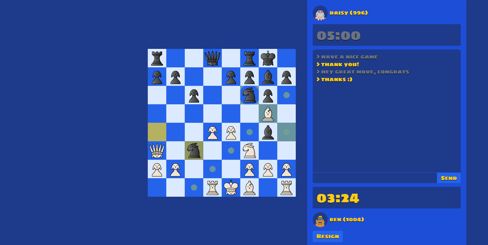
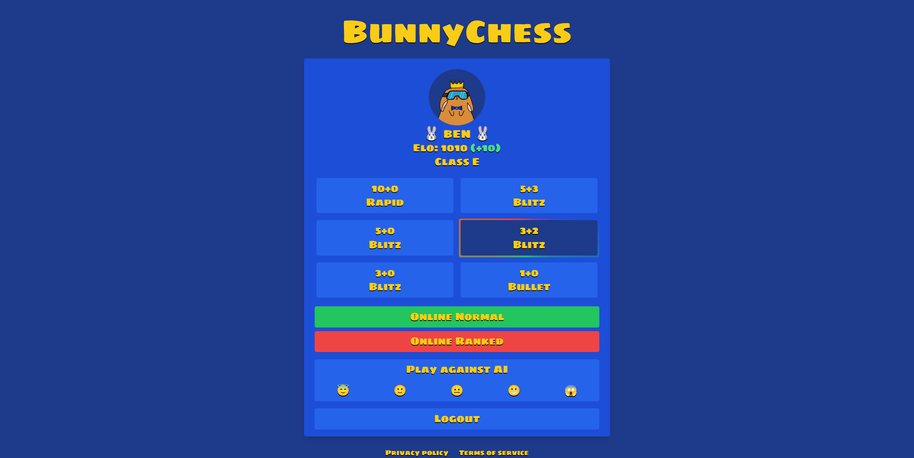
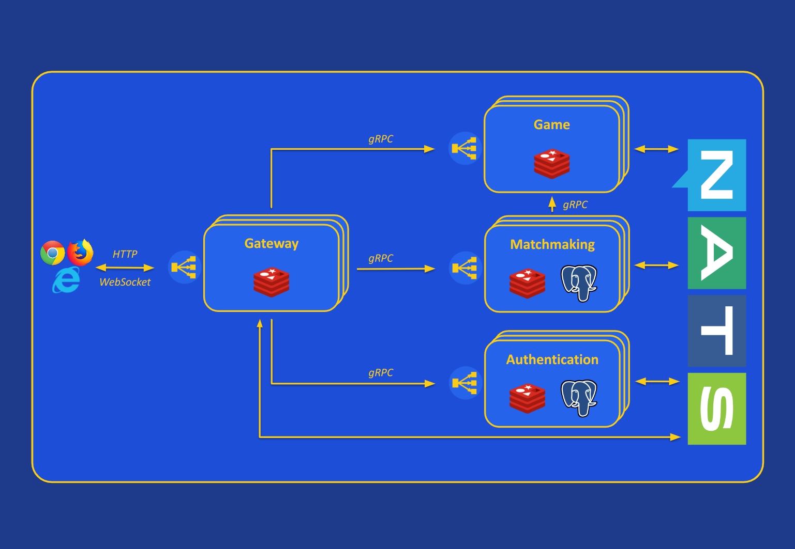

# ♟️🐰 Bunnychess 🐰♟️

### Scalable, distributed, stateless chess server based on gRPC microservices.
#### _Built with [NestJS](https://nestjs.com/) + [Vue.js](https://vuejs.org/), leveraging [NATS JetStream](https://docs.nats.io/nats-concepts/jetstream), [PostgreSQL](https://www.postgresql.org/) and [Redis](https://redis.io/)._

### <ins>Try it here: https://bunnychess.pietrobassi.com</ins>





Included features:
- 🎮 Multiple game modes and ranked/unranked matches
- 🤖 Play against AI ([Stockfish](https://github.com/lichess-org/stockfish.js))
- ⏳ Matchmaking server
- 💪 Fault-tolerant, persistent queues
- 💬 Chat and live matchmaking queues status

Tech stack:
- 💻 Typescript + NestJS microservices (monorepo)
- 🖌️ Vue.js + Pinia
- 📔 NATS JetStream, PostgreSQL ([kysley](https://github.com/kysely-org/kysely)), Redis
- 🗣️ gRPC, WebSocket ([Socket.IO](https://socket.io/)), HTTP
- 🐳 docker compose

Feel free to contact me on LinkedIn for ideas, discussions and opportunities 🙂 https://www.linkedin.com/in/pietro-bassi  

## Scope of the project
This is a toy project designed to experiment with NestJS microservices and gRPC, leveraging NATS JetStream and its persistent queues to demonstrate how it can be used to build fault-tolerant distributed systems.  
The microservices are stateless and horizontally scalable, with Redis used to maintain game state. To support Redis Cluster scaling, no dynamically computed keys are used in Lua scripts.  
A more traditional stateful server approach was intentionally avoided, as it would have reduced the project to a load-balancing exercise between server instances while keeping the game state in memory.  

## Quick start
Clone this repository:  
```
git clone https://github.com/pietrobassi/bunnychess
```  

Navigate inside project root folder:  
```
cd bunnychess/deploy
```  

Start all services ([docker compose](https://docs.docker.com/compose/install/) required):  
```
docker compose up
```

Alternatively, you can start a multi-instance example that demonstrates load balancing for both HTTP/WebSocket requests and gRPC messages with:  
```
docker compose -f load-balancing-example.yml up
```

After some time (first execution might be slow), open browser and navigate to http://localhost  
<br/>

## Observe microservices in action!
Bunnychess is composed of mostly independent microservices, allowing the system to withstand partial outages without disrupting unaffected functionalities. Let’s demonstrate this resilience in practice!
1. **Start the system:** Run `docker compose up` as described in the section above.  
2. **Create two accounts:** Open two different browsers (or one browser + an incognito window) and register two accounts.  
3. **Login and start a match:** Log in with the newly created accounts, **take note of each player's current Elo rankings**, and start searching for a **ranked** _10+0_ match for both accounts. Wait for the match to begin.  
4. **Simulate outages (_Authentication_ & _Matchmaking_):** Once the match starts, the _Authentication_ (used for registering, logging in, and fetching opponent info) and _Matchmaking_ (responsible for pairing players and exposing Elo rankings) microservices are no longer needed.  
   - Open Docker Desktop, manually stop both _Authentication_ and _Matchmaking_ services using the "Stop" button, and wait for the operation to complete.  
5. **Play the game:** Continue playing until the match ends or make one player resign. Then, click the "Back" button to return to the home page.  
   - Notice how the main functionality - playing a chess game - remains unaffected, even though two critical microservices are unavailable.  
6. **Simulate a _Game_ service outage:** Once the game is over, the _Game_ service is no longer needed. Stop it in the same way as _Authentication_ and _Matchmaking_.  
7. **Observe the consequences:** At this point, while the game was successfully completed, the players' Elo scores were not updated.  
   - This is because the _Matchmaking_ service is responsible for storing and updating Elo rankings.  
8. **Recover _Matchmaking_ and update Elo:**  
   - Restart the _Matchmaking_ microservice using the "Start" button in Docker Desktop.  
   - Observe the browser: both players' Elo rankings should now be correctly updated!  
9. **Restore full functionality:** Restart the _Authentication_ and _Game_ services. Notice how the system fully recovers all its functionalities seamlessly.  

### Why This Works  

This behavior is made possible by **NATS JetStream's persistent storage**. Before being stopped, the _Game_ service emitted a `bunnychess.game.game-over` message containing the game outcome. Even though the _Matchmaking_ service was unavailable at the time, NATS saved the message to disk.  

When the _Matchmaking_ service restarted, the pending message was processed, triggering the emission of a new `bunnychess.matchmaking.elo-change` message. This was received by the _Gateway_, which in turn emitted WebSocket messages to update the players' Elo rankings in their browsers.  

This example highlights one of the key advantages of a microservices architecture that leverages a persistent message queue: independent services, fault tolerance and recovery.  

> **Note:** While microservices offer many benefits, adopting a microservices-based solution requires careful consideration. Be realistic about your project's goals and business needs, as microservices architectures in the real world often come with significant infrastructure and maintenance costs compared to simpler, more traditional architectures.  

## Architecture



### Microservices
All microservices are built with NestJS and are part of a single monorepo. A shared _common_ library is used for protobuf definitions and other utilities.

#### Gateway
The Gateway acts as the backend-for-frontend of the project and is the only exposed component of the backend. It handles client requests via HTTP/WebSocket and communicates with internal microservices using gRPC.  
For Socket.IO, it leverages Redis Pub/Sub, adapted to ensure scalability across multiple instances when necessary. It also manages chat messages independently, routing them directly to the intended recipients without involving other services.

#### Authentication
The Authentication service is responsible for storing user information, processing authentication requests, and issuing signed JWTs and refresh tokens.  
It uses Redis to store refresh tokens and perform token rotation, ensuring secure and efficient token management.

#### Matchmaking
The Matchmaking service manages matchmaking queues, pairs players of similar skill levels, and tracks player rankings.  
When two players are matched, it contacts the Game service to create a new chess game instance.  
The matchmaking algorithm is implemented entirely in Redis using Lua scripts and is triggered at regular intervals by a BullMQ job. The algorithm uses an ELO search window that dynamically expands over time, prioritizing players who have waited longer in the queue and it can match over 10000 concurrently enqueued players in less than 30 milliseconds.  
Lua scripts ensure the atomicity of multiple commands and dynamically computed keys are avoided to maintain scalability in Redis Cluster environments.  
The service listens for persistent `bunnychess.game.game-over` events from the Game microservice to update player ELO rankings after a match ends.

#### Game
The Game service handles game creation requests and implements the logic for processing game moves and resignation requests.  
It uses Lua scripts in combination with a sequence number to perform atomic CAS (Check-And-Set) operations when updating game states.  
When a game ends, the service emits a persistent, long-lived game result message (`bunnychess.game.game-over`), ensuring that the Matchmaking service processes the result reliably, even in the event of outages. Each `bunnychess.game.game-over` event includes metadata containing the players' ELO rankings at the start of the game. This simplifies ranking calculations and eliminates the need to limit NATS queue consumer parallelism to preserve the order of game-over events.

### NATS JetStream
NATS is used as the messaging system to enable asynchronous communication between microservices.  
Its built-in persistence engine, **JetStream**, ensures message delivery despite consumer outages and supports automatic retries in case of missing acknowledgments (Acks).  
Streams are defined in the _stream-config.ts_ file and are created at microservice startup. In a real production environment, this setup - along with PostgreSQL database migrations - should ideally be managed in a more controlled manner, possibly through DevOps pipelines. However, for simplicity, it is handled at startup in this project.  
Different streams have different configurations: some events are more volatile and stored in memory for better performance, while others - such as `bunnychess.game.game-over`, which updates player Elo rankings - are persistent and guarantee at-least-once delivery. For critical messages like game-over events, exactly-once processing is enforced using compound unique indexes `<gameId, accountId>` on the _mmrChange_ database table.  

### Observability
The Bunnychess example deployment uses [New Relic](https://newrelic.com/) for logging and APM. Currently, it works in a very basic way, as no additional effort has been made to enhance its out-of-the-box support. As a result, distributed tracing is supported only for HTTP requests, while extended monitoring for WebSocket-initiated traces and BullMQ job execution is not available.  
It's possible to enable New Relic tracing just by adding this code block to each microservice definition inside _docker-compose.yml_ file, after creating your own account and setting your own license key: 

```yaml
environment:
   NEW_RELIC_APP_NAME: bunnychess-MICROSERVICE_NAME
   NEW_RELIC_LICENSE_KEY: ${NEW_RELIC_LICENSE_KEY}
   NEW_RELIC_LOG_LEVEL: debug
command: ["node", "-r", "newrelic", "dist/apps/MICROSERVICE_NAME/main"]
```

### Frontend
The frontend is built using the [Vue.js](https://vuejs.org/) framework, with [Pinia](https://pinia.vuejs.org/) as the centralized state management solution.  
[Tailwind CSS](https://tailwindcss.com/) is utilized as the utility-first CSS framework for styling.  
The chessboard component has been developed from scratch and includes essential features such as move overlays, premoves, promotions, and check alerts. It is designed to be completely stateless, allowing seamless integration with any external chess state management library - in this case, [chess.js](https://github.com/jhlywa/chess.js). All the chess pieces have been drawn by me as vector graphics using [Inkscape](https://inkscape.org/).  
Games against bots are handled entirely on the client side, leveraging _Stockfish.js_ running directly in the browser. This approach minimizes backend load while providing a smooth user experience.

### Open source libraries
A few libraries have been forked to better fit the project's needs, either by modifying their behavior or applying quick-and-dirty fixes:

| Library  | Changes |
| ------------- | ------------- |
| [nestjs-steroids/environment](https://github.com/nestjs-steroids/environment)  | Make it compatible with newer `class-transformer` version |
| [Redningsselskapet/nestjs-plugins](https://github.com/Redningsselskapet/nestjs-plugins)   | Prevent the NestJS server from crashing when sending events if NATS is unavailable and fix reconnection attempts to NATS. Props to the author for creating the NATS JetStream transport for NestJS, since [it's currently not supported](https://github.com/nestjs/nest/issues/13198)  |
| [RobinBlomberg/kysely-codegen](https://github.com/RobinBlomberg/kysely-codegen) | Allow adding a suffix to generated table interface names |
| [stephenh/ts-proto](https://github.com/stephenh/ts-proto) | Add a few options to allow more convenient Date and null/undefined type handling, adding suffixes to generated interface names, etc. |

## Developing
#### Requirements
- [Docker](https://www.docker.com/)
- [Yarn](https://yarnpkg.com/)

The project was developed and tested using Node v22.13.1. I recommend installing it via [nvm](https://github.com/nvm-sh/nvm).

#### Development setup
- Clone this repository, navigate to _/backend_ folder and run `yarn` to install backend dependencies
- Run `yarn docker:up` to start Nats, PostgreSQL and Redis containers in background. If you prefer to run them in foreground, run `yarn docker:attach` instead
- Run `yarn start-all:dev` to start all backend microservices; to enable debugging, run `yarn start-all:debug` instead
- Navigate inside _/frontend_ folder and execute `yarn` to install frontend dependencies
- Execute `yarn dev` to start frontend development server
- Open browser at http://localhost:5173/

#### Testing
To run backend unit tests, navigate to _/backend_ folder and execute:
```
yarn test
```

#### Add a new gRPC method
Let's imagine we want to add a new _deleteAccount_ method to _Authentication_ microservice:
- Define new rpc and message types inside [account _.proto_ file](https://github.com/pietrobassi/bunnychess/blob/main/backend/libs/common/src/authentication/proto/account.proto)
- Run `yarn proto:generate` to generate and update TypeScript [_.pb.ts_ file](https://github.com/pietrobassi/bunnychess/blob/main/backend/libs/common/src/authentication/proto/account.pb.ts)
- Implement the new method inside [Account controller](https://github.com/pietrobassi/bunnychess/blob/main/backend/apps/authentication/src/account/account.controller.ts)
- To publicly expose it via HTTP, go inside _Gateway_ microservice folder and add a new endpoint to [Account controller](https://github.com/pietrobassi/bunnychess/blob/main/backend/apps/gateway/src/account/account.controller.ts) which calls the newly added method [via gRPC](https://github.com/pietrobassi/bunnychess/blob/main/backend/apps/gateway/src/account/account.service.ts) 

#### Add a new database collection
- Add a new entry to one of the migration files (e.g. [the Matchmaking one](https://github.com/pietrobassi/bunnychess/blob/main/backend/apps/matchmaking/src/database/migrations.ts)), defining migration name and up/down commands
- Restart the service to apply the migration (PostgreSQL must be running)
- Add new table name to _--include-pattern_ option of `matchmaking:db:generate-schema` _package.json_ script and run command `yarn matchmaking:db:generate-schema` to generate [Kysley schema](https://github.com/pietrobassi/bunnychess/blob/main/backend/apps/matchmaking/src/database/schema.ts)
- Start using the new table inside repositories, supported by type-safe queries

## Contributing
Bunnychess was created as a fun experiment rather than a serious open-source chess server like [Lichess](https://github.com/lichess-org). However, much like its cousin [Bunnybook](https://github.com/pietrobassi/bunnybook), it serves as a great exercise for developers looking to improve their skills by working on a semi-realistic project.  

Possible improvements and features to develop:  
- Write configuration files to enable deployment on Kubernetes
- Create an independent _History_ microservice to track past matches, ideally using an event-sourcing pattern with persistent messages. This would allow querying match history and retrieving player usernames without directly calling the _Account_ or _Matchmaking_/_Game_ microservices
- Implement a feature that lets players analyze past matches move by move
- Add an AI-powered assistant that provides feedback on player moves
- Integrate authentication via Google or Facebook by splitting the account table into separate _User_ and _Login_ tables, allowing multiple login methods per user. Further, these could be split into separate microservices - where only _User_ contains personally identifiable information - making a multi-regional, GDPR-compliant deployment easier
- Display user-friendly error popups for failed network calls
- Enhance observability with New Relic by implementing custom logic for improved distributed tracing
- Increase unit test coverage and add integration and end-to-end (E2E) tests

